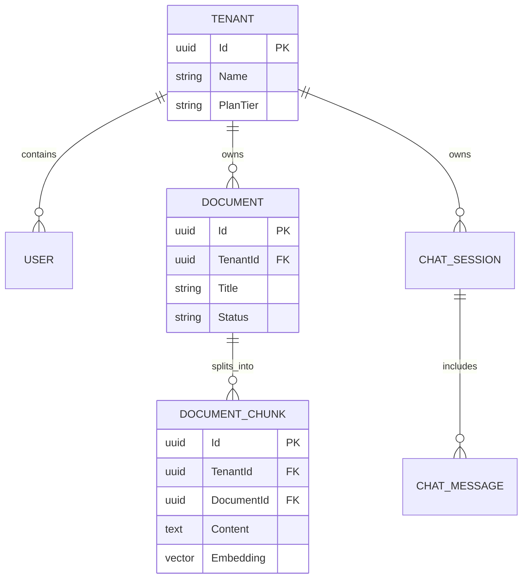

# Database Entity Relationship

```mermaid
erDiagram
    TENANT ||--o{ USER : contains
    TENANT ||--o{ DOCUMENT : owns
    DOCUMENT ||--o{ DOCUMENT_CHUNK : splits_into
    TENANT ||--o{ CHAT_SESSION : owns
    CHAT_SESSION ||--o{ CHAT_MESSAGE : includes

    TENANT {
        uuid Id PK
        string Name
        string PlanTier
    }
    DOCUMENT {
        uuid Id PK
        uuid TenantId FK
        string Title
        string Status
    }
    DOCUMENT_CHUNK {
        uuid Id PK
        uuid TenantId FK
        uuid DocumentId FK
        text Content
        vector Embedding
    }
```